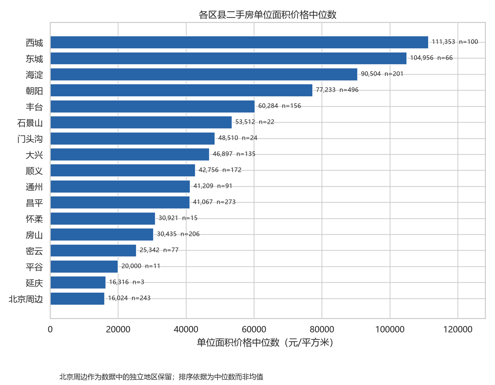
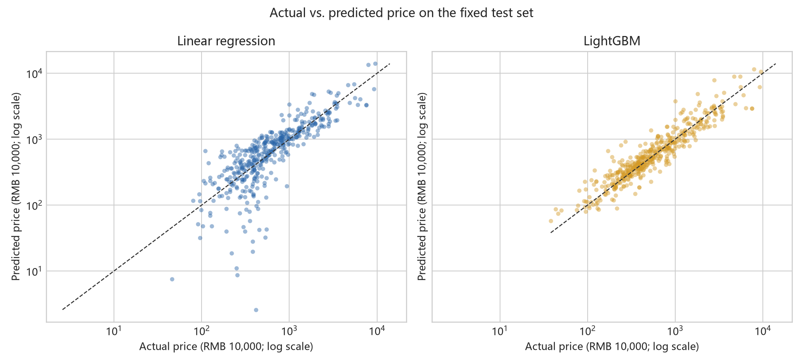

# Beijing Second-Hand Housing Price Analysis

[](https://github.com/xvbohan92-ai/beijing-secondhand-housing-analysis/actions/workflows/ci.yml)

Python, pandas, scikit-learn, LightGBM, Matplotlib, GitHub Actions

This project re-engineers an earlier SPSS-based study into a transparent Python pipeline for data validation, feature engineering, exploratory analysis, and housing-price model evaluation. An earlier manuscript based on this analysis was accepted for presentation at AIDML 2024 but was not published.

[中文说明](README_zh.md) · [Executed notebook](notebooks/01_reproducible_analysis.ipynb) · [Data dictionary](docs/data_dictionary.md)

## Key Results

- 3,000 raw housing records across 17 Beijing districts
- 709 exact duplicate rows identified during data-quality auditing
- 2,291 deduplicated records used for modeling
- LightGBM fixed-split test R²: 0.694
- LightGBM fixed-split test MAE: RMB 2.73M
- 23.9% lower fixed-split test MAE than linear regression
- Dummy mean baseline and deterministic 5-fold cross-validation included
- Automated cleaning and end-to-end smoke tests run in GitHub Actions

The values above are from one fixed 80/20 train-test split (`random_state=42`). Cross-validation results, including fold-to-fold variation, are saved in [`reports/model_results/cross_validation_summary.csv`](reports/model_results/cross_validation_summary.csv).

### Five-Fold Cross-Validation

| Model | MAE mean ± SD (RMB 10,000) | RMSE mean ± SD (RMB 10,000) | R² mean ± SD |
| --- | ---: | ---: | ---: |
| Mean baseline | 745.97 ± 39.64 | 1,396.34 ± 253.47 | -0.004 ± 0.004 |
| Linear regression | 328.68 ± 28.30 | 628.00 ± 104.42 | 0.789 ± 0.068 |
| LightGBM | 252.05 ± 34.62 | 695.52 ± 182.69 | 0.752 ± 0.064 |

LightGBM has the lowest average MAE, while linear regression has the strongest average RMSE and R². The comparison therefore does not support claiming that either model dominates on every metric.





## Reproducibility Scope

**Reproducible code pipeline; full result reproduction requires legally obtained source data.**

The full source CSV is not redistributed because its public redistribution rights have not been confirmed. To reproduce the published numerical results, place a legally obtained copy at `data/raw/anjuke.csv`. The expected file SHA-256 is:

```text
7f20e81711ea0e25caf27cdb47d72ca8227f7a3872d331613448a514d0e98240
```

A 12-row synthetic file at `data/sample/anjuke_synthetic.csv` allows anyone to run and test the complete pipeline without the original data. It is schema-compatible but must not be used to reproduce or interpret the research findings.

## Methods

1. Validate the seven-column input schema and audit missing values.
2. Remove exact duplicate records before any model split.
3. Parse layout into bedroom and living-room counts.
4. Parse location into district and subdistrict; one-hot encode district.
5. Treat construction year 1900 as an unknown-value placeholder.
6. Compare a mean-prediction baseline, linear regression, and LightGBM.
7. Report one fixed holdout evaluation and deterministic 5-fold cross-validation separately.

The results describe predictive association, not causal effects. The available fields omit important valuation factors such as renovation, orientation, transit access, listing date, and total building floors.

## Run Locally

```powershell
python -m venv .venv
.\.venv\Scripts\Activate.ps1
pip install -r requirements.txt

# Public end-to-end demonstration
python src\clean_data.py --input data\sample\anjuke_synthetic.csv
python src\explore.py
python src\model.py
python -m unittest discover -s tests -v
```

For full result reproduction, first place the legally obtained source file at `data/raw/anjuke.csv`, then run the same commands without the `--input` override on the cleaning step.

## Repository Structure

```text
data/sample/                    synthetic public input
data/raw/                       source-data instructions; CSV excluded
data/processed/                 generated cleaned data; CSV excluded
docs/data_dictionary.md         field definitions
notebooks/                      executed reader-facing analysis
reports/figures/                EDA and diagnostic charts
reports/model_results/          holdout and cross-validation results
src/                            cleaning, EDA, and modeling modules
tests/                          unit and end-to-end smoke tests
```

## License

Code is released under the [MIT License](LICENSE). The license does not cover third-party source data.
